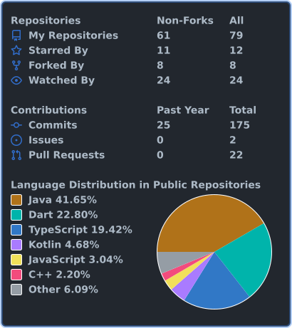

### Hi there 👋

- 🔭 I’m currently working as a **Forward Deployed Engineer @ Trymarkai.com**.
- 🌱 I’m currently exploring the **Stock Market** and learning more about investing.
- 👯 I’m passionate about building **mobile applications** using Android and Flutter.
- 💬 Ask me about **Android, Flutter, Kotlin, Dart, Go, or mobile development**. I’d love to share whatever I know!
- 📫 How to reach me: **chaurasiavipul007@gmail.com**
- ⚡ Hobbies: **Travelling & Gyming**

## 🚀 Technologies & Tools

  
  
  
  
  
  
  

  
  
  
  

## 📊 GitHub Stats

  

